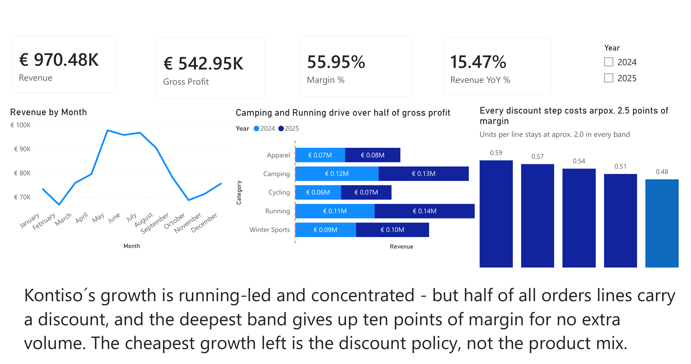
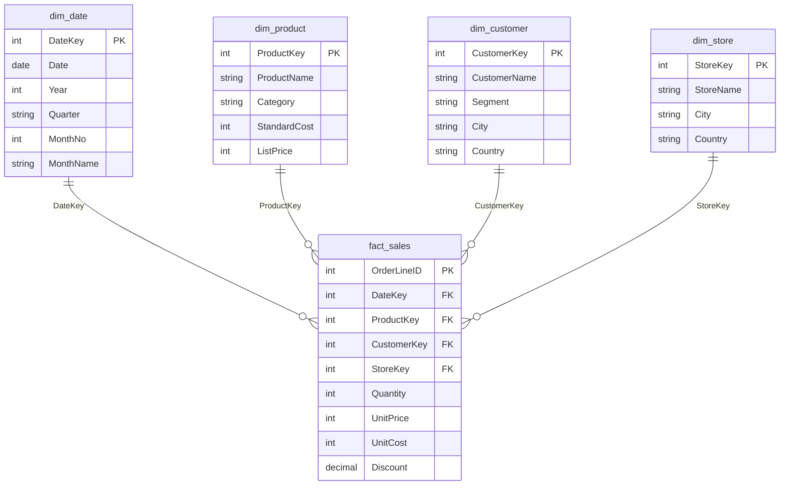

# Kontiso Outdoor — Sales & Discount Analysis in Power BI


A one-page Power BI dashboard for **Kontiso Outdoor**, a fictional outdoor-gear retailer in Austria, Germany and Switzerland. It answers two questions a sales manager would ask after a good year: *where did the growth come from, and is there margin left on the table?*

**Author:** Horia-Iulian State · Vienna · BSc Data Science (IU, in progress)
**Tools:** Power BI Desktop · Power Query · DAX · Python/pandas (cross-check)
**Data:** simulated, 9,546 order lines, Jan 2024 – Dec 2025



📄 PDF exports: [2024–2025](docs/Kontiso-Outdoor-2024-2025.pdf) · [2025, undiscounted lines only](docs/Kontiso-Outdoor-2025-undiscounted.pdf) · 🧮 [DAX measures](model/measures.dax) · 📦 [Power BI file](Kontiso-Outdoor.pbix)

---

## The takeaway

> **Kontiso's growth is running-led and concentrated, but half of all order lines carry a discount, and the deepest band gives up ten points of margin for no extra volume. The cheapest growth left is the discount policy, not the product mix.**

## Key findings

| | Finding | Evidence |
|---|---|---|
| 1 | **Growth is running-led** | Revenue grew **+15.5 %** (€450k → €520k). Running grew +25.7 % and delivered **41 %** of the increase. |
| 2 | **Revenue is concentrated** | Camping + Running bring in **51 %** of revenue and **50.5 %** of gross profit. |
| 3 | **Discounting is the norm** | **50.8 %** of order lines carry a discount of 5–20 %. |
| 4 | **Each discount step costs ~2.5 margin points** | Margin falls from **58.7 %** (no discount) to **48.4 %** (20 % off). |
| 5 | **…without bigger baskets** | Units per line stay at **~2.0** in every band, so deeper discounts don't buy more volume per line. |

| Discount band | Share of lines | Margin % | Units per line |
|---:|---:|---:|---:|
| 0 % | 49.2 % | 58.7 % | 2.02 |
| 5 % | 13.0 % | 56.7 % | 1.97 |
| 10 % | 12.7 % | 54.2 % | 2.01 |
| 15 % | 12.4 % | 51.3 % | 1.96 |
| 20 % | 12.7 % | 48.4 % | 2.01 |

Every number above is recomputed from the raw CSVs in [`checks/verify_kpis.py`](checks/verify_kpis.py) and matches the dashboard.

## What's on the page

| Visual | What it shows | Why this chart |
|---|---|---|
| **KPI cards** | Revenue, Gross Profit, Margin %, Revenue YoY % | The four numbers a manager checks first. |
| **Year slicer** | Filters the whole page to 2024, 2025 or both | Revenue YoY % compares the latest selected year with the year before (blank for 2024, which has no prior year in the data). |
| **Revenue by Month** (line) | Seasonality, both years combined: peak May–July (~€96–98k), low in February (~€67k) | A line shows a trend over time better than bars. |
| **Revenue by Category × Year** (stacked bar) | Each category's size and its 2024 → 2025 change | Horizontal bars keep category names readable. |
| **Margin % by discount band** (column) | Margin drops with every 5-point discount step | The chart behind the recommendation. Units per line sits in the tooltip as a check on volume. |
| **Takeaway text** | The conclusion in one sentence | The reader gets the message without having to work it out from the charts. |

**Cross-filtering:** clicking a bar filters the whole page. The [2025 undiscounted PDF](docs/Kontiso-Outdoor-2025-undiscounted.pdf) shows this: with 2025 selected and the 0 % discount bar clicked, the cards show only full-price lines (€278k revenue at 58.6 % margin, +15.6 % YoY).

Chart titles state the conclusion ("Camping and Running drive over half of gross profit") instead of naming the fields. That idea, and the written takeaway, come from *Storytelling with Data* by Cole Nussbaumer Knaflic.

## Data model

A star schema: one fact table at **order-line grain** (one product on one order) and four dimensions. Each dimension relates one-to-many to the fact, filtering in one direction.



| Table | Rows | Contents |
|---|---:|---|
| `fact_sales` | 9,546 | Order lines: quantity, unit price, unit cost, discount (0–20 %) |
| `dim_date` | 731 | Calendar, 1 Jan 2024 – 31 Dec 2025 |
| `dim_product` | 36 | 5 categories: Apparel, Camping, Cycling, Running, Winter Sports |
| `dim_customer` | 300 | Segment (Consumer / Corporate / Reseller), city, country |
| `dim_store` | 8 | 7 stores in AT / DE / CH + 1 online store |

## DAX measures

All six measures live on `fact_sales`. Full file with comments: [`model/measures.dax`](model/measures.dax).

```dax
Revenue        = SUMX ( fact_sales, fact_sales[UnitPrice] * ( 1 - fact_sales[Discount] ) * fact_sales[Quantity] )
Cost           = SUMX ( fact_sales, fact_sales[UnitCost] * fact_sales[Quantity] )
Gross Profit   = [Revenue] - [Cost]
Margin %       = DIVIDE ( [Gross Profit], [Revenue] )
Units per Line = DIVIDE ( SUM ( fact_sales[Quantity] ), COUNTROWS ( fact_sales ) )

Revenue YoY % =
VAR CurY = MAX ( dim_date[Year] )
VAR Cur  = CALCULATE ( [Revenue], REMOVEFILTERS ( dim_date ), dim_date[Year] = CurY )
VAR Prev = CALCULATE ( [Revenue], REMOVEFILTERS ( dim_date ), dim_date[Year] = CurY - 1 )
RETURN DIVIDE ( Cur - Prev, Prev )
```

**Design decisions**

- **`SUMX` for Revenue, not `SUM`.** The discount belongs to each line, so price × (1 − discount) × quantity has to be calculated row by row before summing. Summing the columns first would give the wrong total.
- **`DIVIDE` instead of `/`.** Returns blank instead of an error when a filter leaves no revenue.
- **YoY with `REMOVEFILTERS` + an explicit year.** The year slicer would otherwise hide the prior year from the calculation. Clearing the date filter and adding back exactly one year lets the card work together with the slicer.
- **Units per Line as a control metric.** It rules out the obvious counter-argument ("discounts lead to bigger baskets") before anyone raises it.

## Limitations

- **The data is simulated.** Seasonality, growth and the discount pattern were built into the data on purpose, so this project shows method, not real-market insight.
- **Correlation, not causation.** Margin falls with discount depth almost by definition (lower price, same cost). The real business question is whether discounts bring in *extra orders*. Answering it would need order-level customer data or a controlled test, such as a holdout group without discounts.

## How to open it

1. Install [Power BI Desktop](https://www.microsoft.com/power-platform/products/power-bi/desktop) (free, Windows).
2. Open `Kontiso-Outdoor.pbix`. The data is imported into the file, so the report works without the CSVs.
3. **To refresh from the CSVs:** *Transform data → Data source settings → Change Source* and point each query to your local `data/` folder (the saved paths are from my machine).

To re-run the numbers check: `pip install pandas`, then `python checks/verify_kpis.py` from the repo root.

## Repository structure

```
kontiso-outdoor-powerbi/
├── Kontiso-Outdoor.pbix           Power BI report + model
├── data/                          simulated source tables (CSV)
│   ├── fact_sales.csv
│   ├── dim_date.csv
│   ├── dim_product.csv
│   ├── dim_customer.csv
│   └── dim_store.csv
├── model/
│   └── measures.dax               all DAX measures, commented
├── checks/
│   └── verify_kpis.py             pandas cross-check of every number
├── docs/
│   ├── Kontiso-Outdoor-2024-2025.pdf         PDF export, both years
│   └── Kontiso-Outdoor-2025-undiscounted.pdf PDF export, 2025 cross-filtered to 0 % discount
└── images/
    ├── dashboard.png                  README screenshot (cropped, high-res)
    └── dashboard-screenshot.jpg       original screenshot
```

## Next steps

- **Budget vs. actual:** add a monthly budget table at month × category grain (coarser than sales, so it needs a bridge table).
- **Returns:** a second fact table with order date and return date, which means a role-playing date dimension (`USERELATIONSHIP`).
- **What-if parameter:** the gross-profit impact of capping discounts at 10 %.
- **Save as `.pbip`** so the model and report are text files that Git can diff.

---

### Kurzfassung (Deutsch)

Ein einseitiges Power-BI-Dashboard für einen fiktiven Outdoor-Händler in der DACH-Region, auf Basis simulierter Daten für 2024–2025. Das Modell ist ein Sternschema mit einer Faktentabelle auf Ebene der Auftragspositionen, vier Dimensionen und sechs DAX-Measures. Das Ergebnis: Das Umsatzwachstum von +15,5 % kommt vor allem aus der Kategorie Running. Die Hälfte aller Auftragspositionen ist rabattiert, und jede Rabattstufe kostet rund 2,5 Prozentpunkte Marge, ohne dass mehr Stück pro Position verkauft werden. Der günstigste verbleibende Wachstumshebel ist deshalb die Rabattpolitik, nicht der Produktmix.

---

*Portfolio project by Horia-Iulian State · [github.com/hiulian69](https://github.com/hiulian69)*
